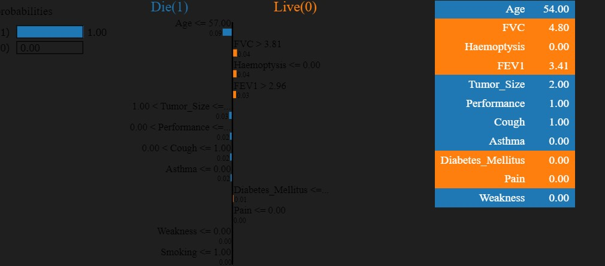

# Life Expectancy Prediction After Thoracic Surgery using Machine Learning with Flask Web App -- Abraham Obianke 

## Introduction 
What is thoracic surgery?
Thoracic surgery includes any operation to treat an issue in your chest and upper abdomen, such as:
Stretched blood vessels (aneurysms),
Congenital (present at birth) heart issues,
Irregular heart rhythms,
Heart failure, and
Coronary artery disease.

*Source:https://my.clevelandclinic.org/health/treatments/24201-thoracic-surgery*

## Patients Problem 
### Problem Context
Complication rates following video assisted thoracoscopic surgery (VATS) lobectomy for lung cancer range between 6% and 34.2% and the mortality rate ranges between 0.6% and 1.3% (1-3). To date, there is no standardization for their classification. Postoperative complications are directly related to treatment effectiveness, prognosis, hospitalization costs and patients’ quality of life.

*Source:https://www.ncbi.nlm.nih.gov/pmc/articles/PMC4522469/#:~:text=Complication%20rates%20following%20video%20assisted,%25%20(1%2D3).*

## Objective(s)
- Predict if a patient having undergone thoracic surgery will live or die after 1 year based on Machine Learning (ML) parameters 

## Dataset Information
     1. Class: DIE, LIVE
     3. FALSE VITAL CAPACITY(FVC): 2.88, 3.4, 2.76
     4. FALSE EXPIRATORY VOLUME1(FEV1): 2.16, 1.88, 2.08
     5. PAIN: no, yes
     6. HAEMOPTYSIS: no, yes
     7. DYSPNOEA: no, yes
     8. COUGH: no, yes
     9. WEAKNESS: no, yes
    10. TUMOR SIZE: no, yes
    11. DIABETES MELLITUS: no, yes
    12. MI_6MO: no, yes
    13. PAD: no, yes
    14. SMOKING: no, yes
    15. ASTHMA: no, yes
    16. AGE: 40, 50, 60, 70, 75, 79
  

    
*Data Source:* https://archive.ics.uci.edu/dataset/277/thoracic+surgery+data

## Mapping Patients Problem to ML Problem

### Type of Machine Learning Problem
+ It is a binary classification problem, where given the above set of features, we need to predict if a given patient having undergone thoracic surgery will live or die post-operatively.

## Data Analysis Workflow
- Data Collection
- Importing Data
- Data Cleaning
  - Handling Missing Data
  - Outlier Detection and Removal
- Data Transformation
- Exploring Data using Descriptive Statistics
  - Understanding Data using
    - Univariate Analysis
    - Bivariate Analysis
    - Multivariate Analysis
- Understanding Data using Visualizations
    - Univariate
      - Histograms
      - Density Plot
    - Bivariate
      - Boxplot
    - Multivariate
      - Correlation Matrix

### Analysis Observations 
1. The highest prevalence of Thoracic surgery complications is between the age range of 50 - 70 years
2. The lowest prevalence of Thoracic surgery complications is between the age range of 10 - 30 years
3. The highest contributing clinical feature is False Expiratory Volume (FEV)

## Model Building 
+ Features Selection
+ Data Train/Test/Split
+ Algorithm Comparism
    - Logistic Regression (LR)
    - Linear Discriminant Analysis (LDA)
    - Decision Tree Classifier (CART)
    - Support Vector Machine (SVM)
    - K-Nearest Neighbor (KNN)
    - Naive Bayes (NB)
+ Serialize (Save Model)

## Model Interpretation
 + I implemented explainable AI techniques to understand the decisions made by the machine learning model for individual patients. With this technique, healthcare professionals can gain insights into which features are most influential in predicting the patient's outcome (i.e., survival or death). 

## Model Evaluation Metrics
Since this is a binary classification problem, I used the following metrics:
* **Confusion matrix** - For getting a better clarity of the number of correct/incorrect predictions made by the model.
* **Classification report** - For providing insights into the model's performance.
* **Accuracy score** - To evaluate the overall performance of the classification model.

## Data-Driven Solution 
  ### Deploying the Model with a Flask Web App
 + To make the model accessible to end-users, I have developed a full fledged web application which provides a friendly user interface where users can input relevant parameters through a web form. Upon submission, the app processes the input data using the accurately trained cloud based machine learning model and provides the predicted outcome of a patient. [Click HERE to Gain FREE Access to the Machine Learning Web App](http://abcruz.pythonanywhere.com/) hosted in the cloud for global usage.

## Model Monitoring and Maintenance 
- I leveraged CometML, a robust model monitoring platform and implemented a quality control check, experiment tracking, and model monitoring techniques to observe data drift, conduct routine maintenance and prevent performance degradation. This is to help ensure model fairness, improve model performance and maintain model reliability.

### Key Achievement(s)
 + Model achieved an overall performance accuracy of >85% using K-Nearest Neighbor (KNN) Machine Learning Algorithm.
 + Model operationalized and deployed on cloud premises for easy accessibility.
 + Model successfully logged for continuous monitoring and routine maintenance.
  
## Technologies Used
- Python 
- Coding Tools
   - VS Code
   - Lightning.ai
- ML Libraries 
  - Scikit-Learn
  - Pandas
  - Numpy
  - Matplotlib
  - Seaborn
  - Lime
  - Joblib
  - Comet ML
- Web App Frameworks 
  - Flask
  - Bootstrap 
  - HTML
  - CSS
  - JavaScript 

## Data Source
The dataset used in this project is sourced from the UCI Machine Learning Repository (https://archive.ics.uci.edu/dataset/277/thoracic+surgery+data).

## Conclusion
This project aims to provide insights into life expectancy prediction after thoracic surgery using machine learning techniques. By analyzing relevant parameters, interpreting the outcome of the black-box model and deploying the machine learning model with a user-friendly Flask web application, I aim to foster trust in clinical adoption and to make the predictive model accessible to healthcare professionals and individuals interested in thoracic surgery prognosis aiding in early detection and preventive care for enhancing patient outcomes.

## Contact
I'm [Abraham Obianke](https://wa.me/+2348160715013), a Medic in Tech, for any enquiries, feedback or collaborations, feel free to [Connect with me on LinkedIn](https://www.linkedin.com/in/abraham-obianke-269112197?utm_source=share&utm_campaign=share_via&utm_content=profile&utm_medium=android_app) or send me an Email via  [abrahamoaks@gmail.com](mailto:your_email@example.com).

## References
1. University of California Irvine Machine Learning Repository (*https://archive.ics.uci.edu/dataset/277/thoracic+surgery+data*)
2. Cleveland Clinic (*Source:https://my.clevelandclinic.org/health/treatments/24201-thoracic-surgery*
*)
3. The National Center for Biotechnology Information (*https://www.ncbi.nlm.nih.gov/pmc/articles/PMC4522469/#:~:text=Complication%20rates%20following%20video%20assisted,%25%20(1%2D3)*)
